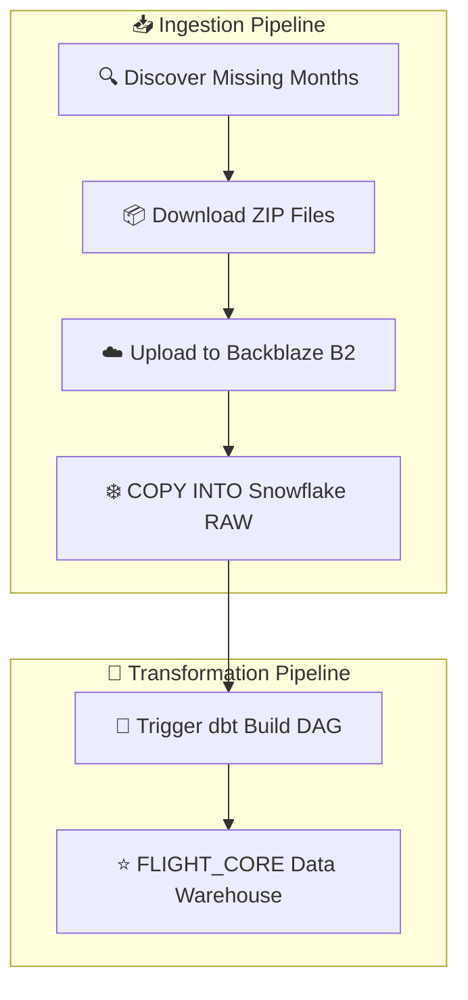
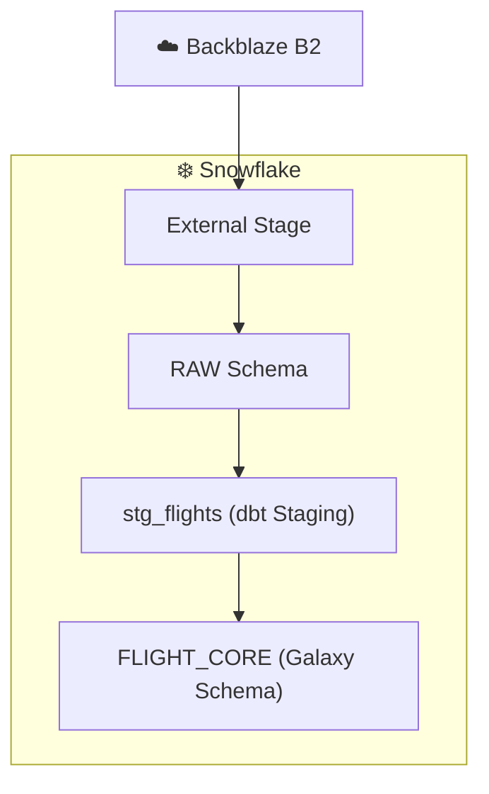

<h1 align="center"> ☁️ Backblaze B2 Landing Zone & Data Lake Architecture</h1>


# 📌 Overview

| Property | Value |
|----------|-------|
| 🏗️ **Architectural Component** | Centralized Cloud Object Storage (Landing Zone / Data Lake) |
| 📊 **Data Scope** | Historical BTS Flight Performance (2024–2026) + Metadata Dimensions |
| 🪣 **Bucket** | `airline-on-time-data-ahmed` |
| 📂 **Stored Formats** | CSV (.zip) & JSON |
| ❄️ **Downstream Consumer** | Snowflake External Stage |

---

# 📝 Layer Overview

This directory documents the **Landing Zone / Data Lake** layer of the BTS Airline Analytics DWH architecture.

**Backblaze B2** acts as an immutable, highly durable cloud object storage layer positioned between the extraction process and the Snowflake warehouse.

All raw source files are automatically downloaded from external data providers using Python (`requests` + `tenacity`) and uploaded via `boto3` (S3-compatible API). Snowflake later consumes these files through an External Stage before dbt performs the transformation layer.

---

# 🖼️ Architecture at a Glance


---

# 🤔 Why Use a Landing Zone?

| 🎯 Challenge | ✅ Solution |
|--------------|------------|
| 🔄 **Decoupling** | Extraction and transformation remain completely independent. A Snowflake or dbt outage never blocks ingestion. |
| 🔒 **Immutability** | Raw files are never modified, allowing the warehouse to be rebuilt from the original source at any time. |
| 💰 **Lower Cost** | Backblaze B2 provides significantly cheaper long-term storage than keeping raw data inside the warehouse. |
| 📝 **Auditability** | Every monthly BTS file is preserved exactly as downloaded for historical reproducibility. |
| ♻️ **Replayability** | Historical months can be reloaded directly from B2 without downloading them again from BTS. |

---

# 🗂️ Storage Structure

The bucket is organized into **two independent data paths**:

- ✈️ **Structured Flight Data** (partitioned by Year/Month)
- 📑 **Semi-Structured Metadata** (JSON dimension files)

```text
airline-on-time-data-ahmed/
└── raw/
    ├── Airline_info.json
    ├── Airport_info.json
    └── flights/
        ├── year=2024/
        │   ├── month=01/flights_2024_01.zip
        │   ├── month=02/flights_2024_02.zip
        │   └── ...
        ├── year=2025/
        │   ├── month=01/flights_2025_01.zip
        │   └── ...
        └── year=2026/
            ├── month=01/flights_2026_01.zip
            └── ...
```

---

# 📦 Why Hive-Style Partitioning?

Using the directory structure:

```text
year=YYYY/month=MM/
```

provides several operational advantages:

- 🚀 **Efficient High-Water-Mark Backfills**
  - The Airflow DAG simply compares existing partitions with `dim_date` to identify missing months.

- 🎯 **Deterministic Paths**
  - Every month's location is known in advance without performing directory listings.

- ❄️ **Snowflake-Friendly Layout**
  - The same partition hierarchy maps naturally to Snowflake External Stages and `COPY INTO` operations.

---

# 📑 Why Separate Flight Data from Metadata?

These datasets have very different characteristics.

### ✈️ Flight Data

- Structured CSV files
- High-volume (~17M+ rows)
- Monthly partitioned
- Continuously growing

### 📄 Metadata

- JSON documents
- Small volume
- Slowly changing
- Refreshed only when necessary

Keeping them in separate paths avoids unnecessary partitioning for metadata while making both datasets easier to manage.


# 📥 End-to-End Ingestion Workflow



### Workflow Steps

1. 🔍 Detect missing `year/month` partitions using High-Water-Mark logic.
2. 🌐 Download monthly ZIP files from the BTS TranStats portal.
3. ☁️ Upload files into Backblaze B2 using the S3-compatible API.
4. ❄️ Load new partitions into Snowflake RAW tables.
5. ⚙️ Trigger the dbt transformation pipeline.
6. 📊 Build the final `FLIGHT_CORE` dimensional model.

The complete workflow is orchestrated by:

- 🚀 `bts_ingestion_pipeline`
- ⚙️ `bts_dbt_build_pipeline`

connected together through `TriggerDagRunOperator`.

---

# 🔒 Immutability & Data Retention

The `raw/` layer follows a **Write-Once** philosophy.

- ✅ Existing files are never modified.
- ✅ Historical data remains reproducible.
- ✅ Source lineage is preserved.
- ✅ BTS corrections are stored as new files instead of replacing existing ones.

This guarantees complete traceability from source system to analytical warehouse.

---

# ❄️ Downstream Consumption

Snowflake accesses the bucket through an **External Stage**.

The ingestion process loads raw files into:

- 📥 `RAW_FLIGHTS_2024`
- 📥 `RAW_FLIGHTS_2025`
- 📥 `RAW_FLIGHTS_2026`
- 📥 Metadata RAW tables

The dbt staging model (`stg_flights`) unions yearly raw tables before building the final **FLIGHT_CORE** fact constellation.

---

