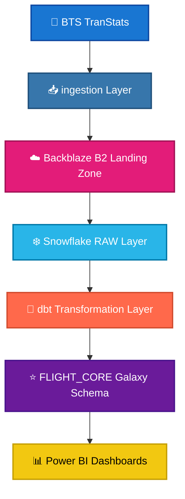
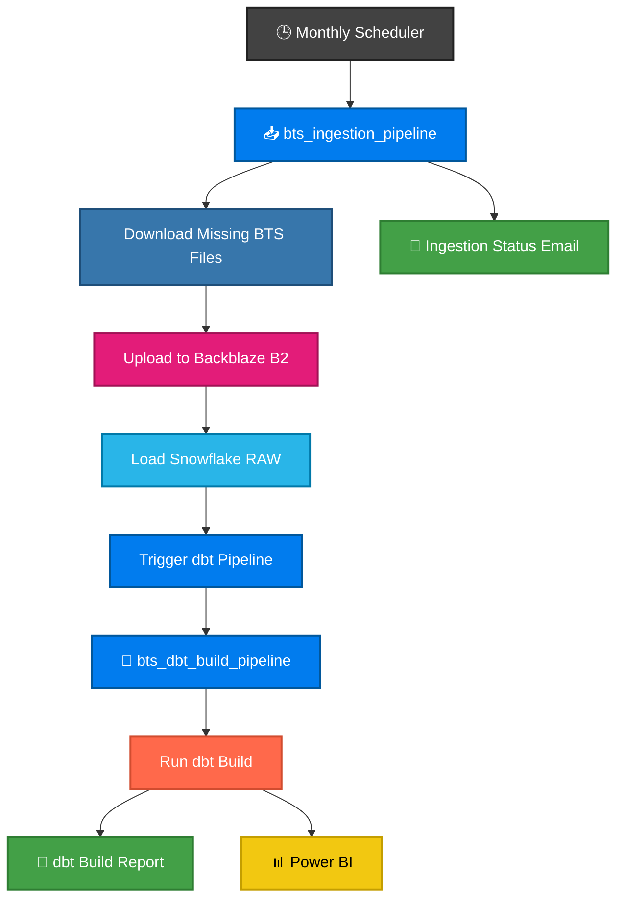

<h1 align="center">✈️ BTS Airline Analytics DWH</h1>


# 📑 Table of Contents

- [📖 Project Overview](#-project-overview)
- [🎯 Business Problem](#-business-problem)
- [📊 Dataset Overview](#-dataset-overview)
- [🏗️ Architecture](#️-architecture)
- [📂 Project Structure](#-project-structure)
- [☁️ Backblaze B2 Landing Zone](#️-backblaze-b2-landing-zone)
- [❄️ Snowflake Data Warehouse](#️-snowflake-data-warehouse)
- [🔄 dbt Transformation Layer](#-dbt-transformation-layer)
- [🌬️ Apache Airflow Orchestration](#️-apache-airflow-orchestration)
- [📊 Power BI Reporting Layer](#-power-bi-reporting-layer)
- [💡 Key Business Insights](#-key-business-insights)
- [🎯 Strategic Recommendations](#-strategic-recommendations)
- [📚 Project Documentation](#-project-documentation)
- [👨‍💻 Author](#-author)

  

# 📖 Project Overview

The **BTS Airline Analytics Data Warehouse** is an end-to-end cloud-based Data Engineering project designed to automate the collection, storage, transformation, and analysis of U.S. domestic flight operations.

The project ingests monthly flight performance data published by the **Bureau of Transportation Statistics (BTS)**, stores the raw files in **Backblaze B2**, loads them into **Snowflake**, transforms them into a production-ready **Galaxy Schema** using **dbt**, orchestrates the entire workflow with **Apache Airflow**, and finally delivers interactive executive dashboards through **Power BI**.

Rather than focusing solely on reporting, this project demonstrates how modern Data Engineering technologies can be integrated into a scalable ELT architecture that supports automated data ingestion, incremental processing, data quality validation, dimensional modeling, and business intelligence.

The resulting warehouse enables airlines and aviation analysts to evaluate operational performance, monitor delays and cancellations, compare airport efficiency, analyze airline reliability, and identify long-term trends affecting domestic air transportation across the United States.


# 🎯 Business Problem

Airline operational data is published monthly as independent files, making it difficult to analyze long-term performance trends, monitor operational efficiency, or produce enterprise-level business reports.

Without a centralized analytics platform, organizations face several challenges:

- Flight data is distributed across dozens of monthly files.
- Operational metrics cannot be analyzed consistently over time.
- Delay and cancellation patterns are difficult to investigate.
- Airport and airline metadata are disconnected from operational records.
- Manual ingestion processes are repetitive and error-prone.
- Reporting requires significant manual preparation before insights can be generated.

To address these challenges, this project builds a fully automated cloud-native analytics platform that continuously ingests new BTS releases, transforms raw operational data into a dimensional warehouse, and delivers interactive dashboards for business users without manual intervention.

# 📊 Dataset Overview

The project is built on the **Bureau of Transportation Statistics (BTS) On-Time Performance Reporting Carrier Dataset**, one of the largest publicly available aviation datasets in the United States.

The dataset contains detailed operational records for domestic commercial flights, including schedules, delays, cancellations, taxi times, distances, and airline information. To enrich the analytical capabilities of the warehouse, the project integrates two additional metadata sources that provide airport attributes and airline ratings.

Together, these datasets form the foundation of a unified aviation analytics platform capable of supporting operational reporting, performance benchmarking, and strategic decision-making.


## 📦 Dataset Summary

| Attribute | Value |
|-----------|-------|
| **Primary Source** | Bureau of Transportation Statistics (BTS) |
| **Coverage** | U.S. Domestic Flights |
| **Time Period** |  2024 –>  2026 |
| **BTS Flight Files** | +30 ZIP Files |
| **Flight Records** | 17+ Million |
| **Raw Data Size** | ~7 GB |
| **Flight Columns** | 75 Columns |
| **Metadata Sources** | 2 JSON Files |
| **Storage Format** | CSV (ZIP) & JSON |


## 📁 Data Sources

| Source | Description |
|---------|-------------|
| ✈️ **BTS On-Time Reporting Carrier Performance** | Monthly operational flight records including schedules, delays, cancellations, taxi times, elapsed times, and distances. |
| 🛫 **OurAirports** | Airport metadata containing airport names, city, state, country, airport type, latitude, longitude, and elevation. |
| ⭐ **Skytrax** | Airline metadata including airline names, classifications, and customer ratings used to enrich the dimensional model. |


# 🏗️ Architecture 

The project follows a modern cloud-native ELT architecture where data flows through multiple specialized layers before reaching business users.
Each layer is responsible for a specific stage of the data lifecycle, ensuring scalability, reliability, and maintainability.


## 🔄 Pipeline Overview





## 🔁 Data Flow

The pipeline follows the ELT (Extract, Load, Transform) paradigm.

1. 📥 Python extracts monthly BTS flight data from official sources.
2. ☁️ Raw files are uploaded to Backblaze B2 as immutable storage.
3. ❄️ Snowflake loads the raw data into staging tables.
4. 🔄 dbt transforms the raw data into a dimensional Galaxy Schema.
5. 🌬 Apache Airflow orchestrates and automates the entire workflow.
6. 📊 Power BI connects directly to the curated warehouse for interactive reporting.


# ⚙️ Technology Stack

The project combines modern cloud technologies to build a scalable, automated, and production-oriented data platform.

| Layer | Technology | Purpose |
|--------|------------|---------|
| ☁️ Cloud Storage | Backblaze B2 | Landing Zone for raw data |
| 🐍 Programming | Python | Data extraction & ingestion |
| ❄️ Data Warehouse | Snowflake | Cloud data warehouse |
| 🔄 Transformation | dbt Core | Data modeling & testing |
| 🌬️ Orchestration | Apache Airflow | Workflow automation |
| 🐳 Containerization | Docker Compose | Local deployment |
| 🐘 Metadata Database | PostgreSQL | Airflow metadata |
| 📬 Message Broker | Redis | Celery task queue |
| 📊 Visualization | Power BI | Business Intelligence |
| 📚 Version Control | Git & GitHub | Source code management |


# 📂 Project Structure

```text
BTS-Airline-Analytics
│
├── airflow-docker/           # Apache Airflow orchestration
│
├── BTS_Transformation/       # dbt project
│
├── PowerBI/                  # Dashboards & reports
│
├── Snowflake/                # Snowflake 
│
├── Backblaze/                # Backblaze
│
├── README.md                 # Project documentation
│
└── LICENSE
```

The repository is organized by architectural layer, allowing each component of the data platform to remain modular, independently documented, and easy to maintain.

# ☁️ Backblaze B2 Landing Zone

The Landing Zone serves as the project's immutable cloud object storage layer, acting as the entry point for all incoming datasets before they reach the data warehouse.

Rather than loading files directly into Snowflake, every dataset is first stored in **Backblaze B2**, providing a durable, low-cost, and replayable storage layer that separates data ingestion from downstream processing.

This architectural decision improves reliability, simplifies recovery, and preserves the original source files for future reprocessing.

> 📖 For a detailed explanation of the Landing Zone architecture, storage strategy, and ingestion workflow, see the [Backblaze B2 Documentation](./Backblaze/README.md).


## Responsibilities

- Store raw BTS monthly flight files
- Preserve immutable historical data
- Maintain metadata JSON files
- Enable replayable data ingestion
- Decouple extraction from transformation
- Reduce warehouse storage costs


## Landing Zone Architecture


# ❄️ Snowflake Data Warehouse

Snowflake serves as the centralized cloud data warehouse where raw flight records are transformed into a business-ready analytical model.

The warehouse follows a layered architecture consisting of a RAW ingestion layer and a curated dimensional model (**FLIGHT_CORE**) designed for high-performance analytical workloads.

The transformation process follows the ELT paradigm, where raw data is first loaded into Snowflake and then transformed using dbt.

# Snowflake Schema Strcture


> 📖 Detailed Snowflake implementation can be found in the [Snowflake Documentation](./Snowflake/README.md).


# Warehouse Layers

The warehouse follows a multi-layered ELT architecture implemented with **dbt**, where each layer has a well-defined responsibility. This design improves modularity, maintainability, and data quality while enabling scalable analytical workloads.

## ELT Pipeline


---

### 🥉 RAW Layer

The RAW layer serves as the immutable landing zone, storing source data exactly as it is ingested from Backblaze B2 into Snowflake without business transformations.

**RAW tables:**

- `RAW_FLIGHTS_2024`
- `RAW_FLIGHTS_2025`
- `RAW_FLIGHTS_2026`
- `RAW_AIRPORT_INFO`
- `RAW_AIRLINE_INFO`

---

### 🥈 Staging Layer

The Staging layer cleans and standardizes raw datasets into reusable models that serve as the foundation for downstream transformations.

**Responsibilities**

- Standardize data types
- Handle invalid and missing values
- Rename and organize columns
- Apply business rules
- Create reusable staging models

**Staging models:**

- `stg_flights`
- `stg_airport_info`
- `stg_airline_info`

---

### 🥇 Analytics Layer

The Analytics layer contains the final dimensional warehouse, implemented as a **Galaxy Schema** following Kimball modeling principles. It is optimized for analytical queries and business intelligence workloads.

**Dimension Models**

- `dim_date`
- `dim_airport`
- `dim_airline`

**Fact Models**

- `fact_flight`
- `fact_flight_delay`
- `fact_flight_operation`


# ⭐ Data Model (Galaxy Schema)

The warehouse is modeled as a **Fact Constellation (Galaxy Schema)** to support multiple analytical subject areas while sharing common business dimensions.

Unlike a traditional Star Schema, the Galaxy Schema allows several fact tables to reuse the same conformed dimensions, reducing redundancy and improving analytical flexibility.


## Fact Tables

| Table | Purpose |
|--------|---------|
| ✈️ `fact_flight` | Core flight information |
| ⏱️ `fact_flight_delay` | Delay analysis |
| ⚙️ `fact_flight_operation` | Operational metrics and cancellations |


## Dimension Tables

| Table | Description |
|--------|-------------|
| 📅 `dim_date` | Calendar attributes and holidays |
| 🛫 `dim_airline` | Airline metadata and ratings |
| 🏢 `dim_airport` | Airport information and classifications |


## Why Galaxy Schema?

The Galaxy Schema was selected because it enables:

- Shared dimensions across multiple business processes
- Better analytical flexibility
- Reduced data redundancy
- Simpler maintenance
- Improved query performance
- Easy future expansion


# 🔄 dbt Transformation Layer

dbt is responsible for transforming raw operational data into trusted analytical models while enforcing data quality and documentation.

The transformation layer converts raw flight records into a clean dimensional warehouse through modular SQL models, incremental loading, automated testing, and comprehensive documentation.

> 📖 Complete transformation documentation is available in the [dbt Documentation](./BTS_Transformation/README.md).
 

## dbt Responsibilities

- Clean raw data
- Standardize data types
- Build dimensional models
- Generate surrogate keys
- Execute incremental models
- Validate data quality
- Generate documentation


# dbt Lineage Graph


The lineage graph illustrates the dependencies between staging models, dimensions, and fact tables, making the transformation workflow transparent and easy to maintain.


## Data Quality

The transformation layer includes automated validation to ensure the warehouse remains reliable.

### Validation Includes

- Primary Key Tests
- Unique Tests
- Not Null Tests
- Accepted Values Tests
- Relationship Tests
- Unit Tests
- Custom Business Rule Tests


# 🌬️ Apache Airflow Orchestration

Apache Airflow orchestrates the entire data pipeline by automating monthly data ingestion, coordinating warehouse updates, and triggering downstream transformations.

Instead of relying on manual execution, Airflow ensures that every newly published BTS dataset is automatically discovered, ingested, transformed, and made available for reporting through a reliable and fault-tolerant workflow.

The orchestration layer separates data ingestion from data transformation, allowing each process to be monitored, retried, and maintained independently.

> 📖 For complete implementation details, DAG definitions, and orchestration architecture, see the [Airflow Documentation](./airflow-docker/README.md).


## Workflow Overview

The orchestration layer is implemented using two decoupled Apache Airflow DAGs. The ingestion pipeline discovers and loads new BTS datasets into Snowflake RAW tables, then automatically triggers the dbt transformation pipeline. Both DAGs send email notifications summarizing their execution status, enabling continuous monitoring and rapid issue detection.


## DAG Architecture

| DAG | Responsibility |
|------|----------------|
| 📥 **bts_ingestion_pipeline** | Discovers missing monthly datasets, downloads BTS data, uploads files to Backblaze B2, loads Snowflake RAW tables, triggers the dbt pipeline, and sends an execution status email |
| 🔄 **bts_dbt_build_pipeline** | Executes `dbt build` to refresh the  Data Warehouse and sends a summary email containing the build results |

Separating ingestion from transformation improves monitoring, retry handling, and operational flexibility.


## Pipeline Workflow



## Reliability Features

The orchestration layer includes several mechanisms to improve reliability and resilience.

- Automatic retries with exponential backoff
- High-water-mark incremental ingestion
- Schema validation before loading
- Decoupled ingestion and transformation DAGs
- Automatic downstream DAG triggering
- Automated email notifications for both pipelines
- Recovery after missed schedules
- Fault-tolerant network operations


## Successful DAG Execution

The figure below shows both Airflow DAGs completing successfully. The ingestion pipeline loads the latest BTS data, triggers the dbt transformation pipeline, and both workflows send automated email notifications upon completion.


# 📊 Power BI Reporting Layer

Power BI serves as the presentation layer of the platform, transforming the curated warehouse into interactive dashboards that support operational monitoring and executive decision-making.

The reporting layer connects directly to the **FLIGHT_CORE** dimensional model built by dbt, ensuring that every visualization is powered by trusted and validated data.

> 📖 Complete dashboard documentation is available in the [Power BI Documentation](./PowerBI/README.md).

---

# Executive KPIs

The dashboards provide a high-level overview of airline operational performance through several executive KPIs.

| KPI | Value |
|------|------:|
| ✈️ Total Flights | 17M+ |
| ✅ On-Time Arrival Rate | 78.9% |
| 🛫 On-Time Departure Rate | 78.6% |
| ⏱ Average Departure Delay | 13.1 Minutes |
| ⌛ Average Arrival Delay | 8.27 Minutes |
| 📍 Average Flight Distance | 840 Miles |
| ❌ Cancellation Rate | 1.56% |

---

# Dashboard 1 — Flight Performance & Cancellations


## Purpose

Provides an executive overview of airline operations, flight volumes, cancellation trends, and seasonal traffic patterns.

### Main Visualizations

- KPI Cards
- Flights by Airline
- Monthly Flight Trend
- Cancellation Reasons
- Holiday Cancellation Analysis

### Business Questions Answered

- Which airlines operate the most flights?
- Which months experience the highest traffic?
- What causes most cancellations?
- How do holidays affect airline operations?

### Key Findings

- Southwest Airlines operates the highest flight volume.
- Weather is the leading cause of flight cancellations.
- March experiences the highest traffic volume.
- Holiday periods increase operational disruptions.


# Dashboard 2 — Delay Analysis


## Purpose

Analyzes operational delays across airlines, airports, and states to identify performance bottlenecks and improvement opportunities.

### Main Visualizations

- Delay Breakdown by Airline
- State Performance Analysis
- Airport Type Analysis
- Airline Rating Correlation
- Highest Delay States

### Business Questions Answered

- Which airlines experience the largest delays?
- Which airport types generate the most delay minutes?
- Which states have the poorest operational performance?
- Does airline rating correlate with operational reliability?

### Key Findings

- Large airports account for the largest share of delay minutes.
- Weather and carrier delays dominate overall delay performance.
- Some low-volume states experience disproportionately high delays.
- Airline ratings show only a weak correlation with on-time performance.

---

# Dashboard Capabilities

The reporting layer supports interactive business exploration through:

- Cross-filtering
- Dynamic slicers
- Drill-down analysis
- KPI monitoring
- Geographic comparisons
- Airline benchmarking
- Monthly trend analysis
- Operational performance tracking


# 💡 Key Business Insights

The integrated analytics platform reveals several important operational insights.

### 🌦 Weather Remains the Largest Operational Risk

Weather-related disruptions account for the majority of flight cancellations, highlighting the need for better forecasting and operational contingency planning.


### 🛫 Large Hub Airports Experience the Greatest Operational Pressure

Major airports contribute the highest share of delay minutes, indicating congestion and capacity constraints at high-traffic hubs.


### 📈 Flight Demand Follows Clear Seasonal Patterns

Traffic volume varies significantly throughout the year, emphasizing the importance of seasonal staffing and capacity planning.


### 🏢 Airline Performance Varies Significantly

Operational efficiency differs considerably across airlines, creating opportunities for benchmarking and best-practice analysis.


### 📍 Geographic Performance Is Uneven

While high-volume states maintain relatively stable performance, several lower-volume regions experience substantially higher average delays.


# 🎯 Strategic Recommendations

Based on the analytical findings produced by the data warehouse and Power BI dashboards, several strategic recommendations can be made to improve airline operational efficiency and enhance passenger experience.


## 🌦️ 1. Strengthen Weather Response Strategies

Weather accounts for the largest percentage of flight cancellations across the analyzed period.

### Recommendation

- Improve integration with advanced weather forecasting systems.
- Increase schedule flexibility during severe weather seasons.
- Position reserve aircraft and standby crews at major operational hubs.
- Develop dynamic rerouting strategies for weather-sensitive regions.

### Expected Benefits

- Lower cancellation rates
- Improved schedule reliability
- Better passenger satisfaction


## 🛫 2. Optimize Operations at Major Airports

Large airports generate the highest proportion of delay minutes due to congestion and infrastructure limitations.

### Recommendation

- Improve gate allocation algorithms.
- Reduce aircraft turnaround times.
- Increase staffing during peak operating hours.
- Expand use of predictive gate management systems.

### Expected Benefits

- Reduced departure delays
- Improved airport throughput
- Better resource utilization


## 🔧 3. Reduce Carrier-Controlled Delays

Carrier-related delays remain one of the largest controllable operational factors.

### Recommendation

- Expand preventive maintenance programs.
- Improve aircraft rotation planning.
- Optimize crew scheduling.
- Minimize unnecessary aircraft swaps.

### Expected Benefits

- Higher aircraft availability
- Improved operational reliability
- Lower maintenance disruptions


## 📅 4. Improve Seasonal Capacity Planning

Flight demand follows clear seasonal trends throughout the year.

### Recommendation

- Increase staffing before high-demand periods.
- Allocate additional aircraft to busy routes.
- Improve demand forecasting models.
- Schedule preventive maintenance during low-demand months.

### Expected Benefits

- Better operational stability
- Reduced congestion
- Improved customer experience

## 🎄 5. Prepare More Effectively for Holiday Operations

Holiday periods consistently experience increased operational disruptions.

### Recommendation

- Deploy additional operational staff.
- Increase reserve aircraft availability.
- Enhance passenger communication.
- Monitor operational KPIs more frequently during holidays.

### Expected Benefits

- Lower cancellation rates
- Faster operational recovery
- Improved passenger confidence


## 📍 6. Investigate High-Delay States

Several states consistently report significantly higher average delays.

### Recommendation

- Conduct airport-level operational assessments.
- Identify local infrastructure constraints.
- Coordinate with airport authorities to improve traffic flow.
- Analyze route-specific operational bottlenecks.

### Expected Benefits

- Regional performance improvements
- Better network efficiency
- Reduced average delay minutes

---

## 📊 7. Establish Continuous KPI Monitoring

Operational performance should be monitored continuously rather than through periodic reporting.

### Recommendation

Track executive KPIs such as:

- On-Time Performance
- Cancellation Rate
- Delay Minutes
- Airport Congestion
- Airline Reliability
- Flight Volume
- Aircraft Utilization

### Expected Benefits

- Faster operational decision-making
- Early anomaly detection
- Improved executive visibility


# 📚 Project Documentation

This repository is divided into several independently documented components.

| Component | Documentation |
|-----------|---------------|
| ☁️ Backblaze B2 Landing Zone | [`Backblaze/README.md`](./Backblaze/README.md) |
| ❄️ Snowflake Data Warehouse | [`Snowflake/README.md`](./Snowflake/README.md) |
| 🔄 dbt Transformation | [`BTS_Transformation/README.md`](./BTS_Transformation/BTS_Transformation/README.md) |
| 🌬️ Apache Airflow | [`airflow-docker/README.md`](./airflow-docker/README.md) |
| 📊 Power BI Reporting | [`PowerBI/README.md`](./PowerBI/README.md) |

Each module includes detailed documentation covering architecture, implementation, design decisions, and operational workflow.


# 👨‍💻 Author

### **Youssef Yaser**

Aspiring Data Engineer passionate about building scalable data platforms, cloud-native data warehouses, and modern analytics solutions.

# Connect with Me

### - 💼 LinkedIn: https://www.linkedin.com/in/youssef-yasser-data/
### - 💻 GitHub: https://github.com/Youssef-Yaser
### - 📧 Email: youssefyaser561974@gmail.com

