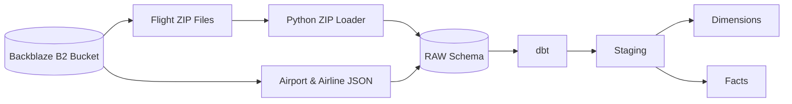
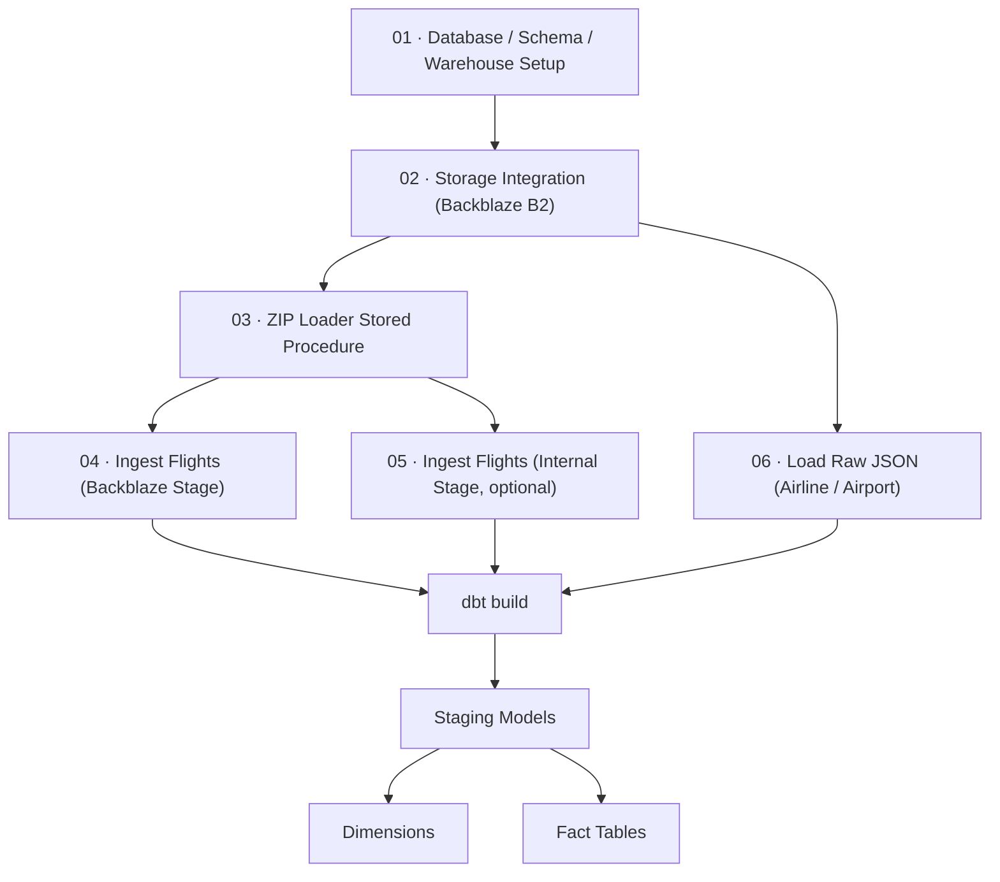

# ❄️ Snowflake Setup

This directory contains all SQL scripts required to provision the Snowflake environment for the **BTS Airline Analytics Data Warehouse**.

These scripts prepare the complete infrastructure used by the project, including the database, schemas, warehouse, external storage integration, Python stored procedures, raw tables, and data ingestion processes.


> **Important**
>
> The Snowflake environment **must be fully provisioned before running `dbt build`**.
> dbt only performs transformations and assumes that all infrastructure and raw data already exist.

---

# 🏗️ What Gets Created

Running these scripts provisions the following Snowflake resources:

- 🗄️ Database
- 📂 RAW Schema
- 📊 FLIGHT_CORE Schema
- ⚡ Virtual Warehouse
- ☁️ External Stage (Backblaze B2)
- 🐍 Python Stored Procedure for ZIP Extraction
- 📁 Raw Flight Tables
- 📄 Raw JSON Tables
- 📥 Data Loading Pipelines

After provisioning is complete, the project is ready for dbt transformations.

---

# 🚀 Execution Order

Run the scripts **in the following order**.

| Step | Script | Description |
|------|---------|-------------|
| 1️⃣ | `01_database_schema_setup.sql` | Creates the project database, required schemas (`RAW` and `FLIGHT_CORE`), and the virtual warehouse used throughout the project. |
| 2️⃣ | `02_storage_integration_backblaze.sql` | Configures the external stage and storage integration that connects Snowflake to the Backblaze B2 bucket containing the project datasets. |
| 3️⃣ | `03_zip_loader_procedure.sql` | Creates a Python stored procedure that automatically extracts CSV files from ZIP archives and loads them into Snowflake raw tables. |
| 4️⃣ | `04_ingest_flights_backblaze.sql` | Loads all flight ZIP files directly from the Backblaze external stage into the RAW schema. |
| 5️⃣ | `05_ingest_flights_internal_stage.sql` | Alternative ingestion method that loads flight ZIP files from a Snowflake internal stage instead of Backblaze. |
| 6️⃣ | `06_load_raw_json.sql` | Creates the raw JSON tables and ingests airline and airport metadata into Snowflake using VARIANT columns. |


# 📊 Data Flow



# 🔄 Workflow




# 🧱 Data Loading Strategy

The Snowflake layer is responsible only for **data ingestion**.

Raw data is intentionally loaded with minimal transformation.

- Flight CSV files are imported into raw tables.
- Airport and airline metadata are stored as semi-structured JSON (`VARIANT`).
- Empty strings are preserved during ingestion.
- No business logic is applied.
- No joins are performed.
- No data quality rules are enforced.
- No type conversions occur during loading.

All cleansing, casting, standardization, surrogate key generation, and business transformations are handled later inside the dbt project.

---

# 📦 Raw Data Sources

The project ingests two different categories of data.

| Dataset | Format | Target |
|----------|---------|--------|
| Flight Operations | ZIP → CSV | RAW Tables |
| Airport Metadata | JSON | VARIANT Table |
| Airline Metadata | JSON | VARIANT Table |

---

# ▶️ Running the Project

Execute the Snowflake setup scripts first:

```sql
01_database_schema_setup.sql
02_storage_integration_backblaze.sql
03_zip_loader_procedure.sql
04_ingest_flights_backblaze.sql
05_ingest_flights_internal_stage.sql   (optional alternative)
06_load_raw_json.sql
```

After the environment has been provisioned and the raw data has been loaded:

```bash
dbt build
```

dbt will then build:

- Staging Models
- Conformed Dimensions
- Fact Tables
- Data Tests
- Documentation

---

# 🛠️ Utility Scripts

These scripts are not required during the initial setup but are useful during development and testing.

| Script | Purpose |
|---------|---------|
| `07_teardown.sql` | Completely removes the project by dropping the database, warehouse, schemas, stages, and raw tables. Useful for rebuilding everything from scratch. |
| `08_drop_dims_and_facts.sql` | Removes only the dbt-generated views, dimensions, and facts inside `FLIGHT_CORE` while preserving all raw data. Ideal for testing repeated `dbt build` executions. |

---

# 🔐 Security Notes

- Never commit real Backblaze credentials.
- Replace all credential placeholders locally before executing the scripts.
- Keep `AWS_KEY_ID` and `AWS_SECRET_KEY` outside version control.
- Consider using Snowflake Secrets or environment variables in production environments.

---

# 📌 Design Principles

This setup follows a modern ELT architecture.

- Snowflake is responsible for infrastructure and data ingestion.
- Raw data remains unchanged after loading.
- dbt performs all transformations.
- Business logic is isolated from ingestion.
- Semi-structured JSON is preserved in `VARIANT` format.
- The project is fully reproducible by executing the scripts in order.

---

# 📂 Directory Overview

```text
snowflake/
│
├── 01_database_schema_setup.sql
├── 02_storage_integration_backblaze.sql
├── 03_zip_loader_procedure.sql
├── 04_ingest_flights_backblaze.sql
├── 05_ingest_flights_internal_stage.sql
├── 06_load_raw_json.sql
├── 07_teardown.sql
├── 08_drop_dims_and_facts.sql
├── assets/
│   └── snowflake_setup_flow.svg
└── README.md
```


# 🚀 Data Ingestion Engine (`ingestion_pipeline.py`)

> **Architectural Component:** External Managed In-Memory ETL Pipeline
> **Status:** 🟢 ACTIVE PRODUCTION ENGINE

---

### ⚠️ CRITICAL ARCHITECTURAL NOTICE (READ BEFORE RUNNING)
> **NOTE ON REPOSITORY SQL ARTIFACTS:** > The neighboring `.sql` scripts located within this directory (such as legacy loop blocks and stored procedures) represent the **Initial Server-Side Architecture Phase** of this project. 
> Due to native cloud security walls and authorization constraints regarding Scoped URL validation inside Snowflake Trial Accounts, processing was migrated away from server-side procedural SQL loops. 
> 
> **`ingestion_pipeline.py` is the official, active pipeline driver used to populate the warehouse.** The `.sql` files are preserved exclusively to document our technical iteration history and architectural design choices for the evaluation panel.

---

## 📝 Pipeline Overview

This script serves as our high-throughput, automated data ingestion engine. It functions as an in-memory orchestration client that bridges our **Backblaze B2 Landing Zone** directly with our **Snowflake Raw Data Warehouse Layer**. It dynamically processes 29 compressed flight performance archives across a three-year timeline (2024–2026) with zero local storage overhead.

## ⚙️ Core Technical Capabilities

1. **Zero-Disk In-Memory Streaming:** Leveraging the `boto3` SDK, compressed `.zip` payloads are fetched over HTTPS directly into volatile memory (RAM). Files are extracted and transformed dynamically using `zipfile` and `pandas` streams, completely bypassing local disk read/write bottlenecks.
2. **Deterministic File Filtering:** The script scans archive internals programmatically and isolates only the raw source `.csv` dataset. Metadata artifacts like `readme.html` are explicitly skipped and discarded during runtime.
3. **Adaptive Schema Mapping:** To eliminate casing mismatches and layout mutations, the script queries Snowflake target table descriptors (`LIMIT 0`) at runtime. It performs an case-insensitive intersection map, dynamically dropping unmapped columns or structural anomalies like implicit pandas index strings.
4. **Reserved Word Isolation (`quote_identifiers=True`):** Enforces explicit identifier quoting during bulk-copy operations. This prevents parsing failures caused by native database keywords present in the dataset schema, such as the `YEAR` column.
5. **High-Performance Mass Insertion:** Utilizes Snowflake’s specialized `write_pandas` extension to chunk dataframes and push optimized parquet streams directly into target staging layers
