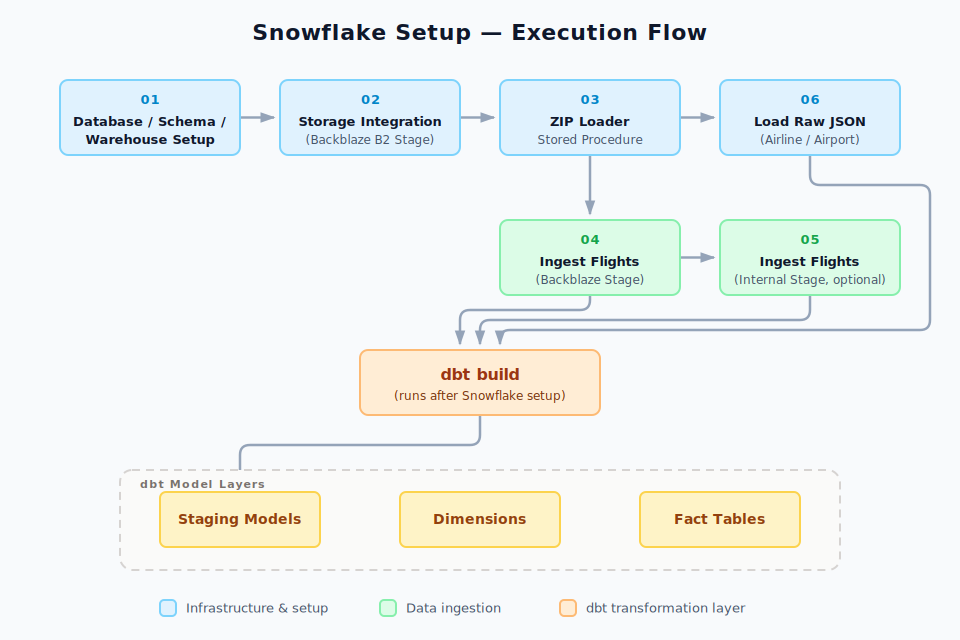
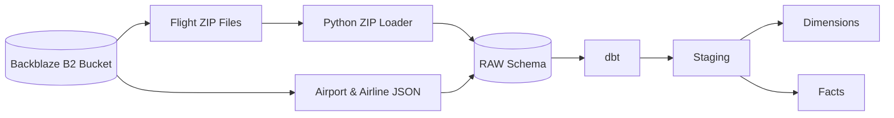
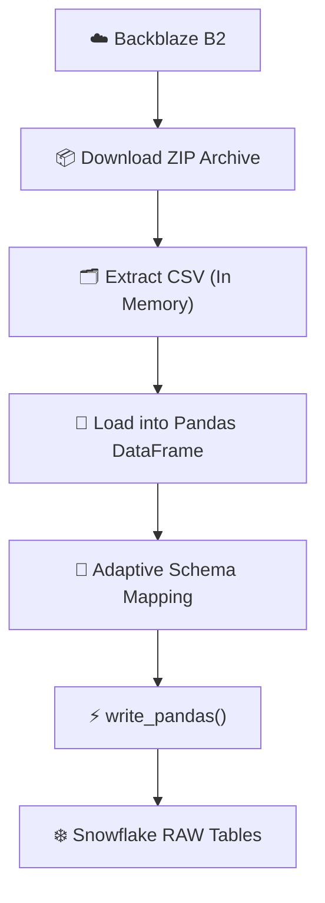

<h1 align="center">❄️ Snowflake Infrastructure & Data Ingestion</h1>

Infrastructure layer for the **BTS Airline Analytics Data Warehouse**.


This directory provisions the complete Snowflake environment and loads raw datasets into the **RAW** layer before **dbt** transformations begin.



> **Important**
>
> The Snowflake environment **must be fully provisioned before running `dbt build`**. dbt assumes that all infrastructure and raw data already exist.

---

# ✨ Responsibilities

- Provision Snowflake infrastructure
- Configure Backblaze B2 storage integration
- Create ingestion components
- Load raw flight datasets
- Load airport and airline metadata
- Prepare the warehouse for dbt transformations

---

# 🏗️ Infrastructure Components

| Component | Purpose |
|-----------|---------|
| Database | Project database |
| RAW Schema | Landing zone for raw datasets |
| FLIGHT_CORE Schema | Target schema for dbt models |
| Virtual Warehouse | Compute resources |
| Storage Integration | Connects Snowflake to Backblaze B2 |
| External Stage | Reads cloud files |
| Python Stored Procedure | ZIP extraction |
| Raw Flight Tables | Flight CSV storage |
| Raw JSON Tables | Airport & Airline metadata |

---

# 🚀 Execution Order

| Step | Script | Description |
|------|--------|-------------|
| 01 | `01_database_schema_setup.sql` | Create database, schemas and warehouse |
| 02 | `02_storage_integration_backblaze.sql` | Configure Backblaze B2 integration |
| 03 | `03_zip_loader_procedure.sql` | Create Python ZIP loader |
| 04 | `04_ingest_flights_backblaze.sql` | Load flight archives from Backblaze |
| 05 | `05_ingest_flights_internal_stage.sql` *(Optional)* | Alternative ingestion using an internal stage |
| 06 | `06_load_raw_json.sql` | Load airport and airline metadata |

---

# 📊 Data Flow



---

# 🧱 Data Loading Strategy

Snowflake is responsible only for **data ingestion**.

| Snowflake | dbt |
|------------|-----|
| Load CSV files | Clean & standardize data |
| Store JSON as `VARIANT` | Cast data types |
| Preserve raw values | Generate surrogate keys |
| No joins | Business transformations |
| No validation | Data quality tests |
| No business logic | Dimensional modeling |

Raw data remains unchanged after loading to ensure traceability and reproducibility.

---

# 📦 Raw Data Sources

| Dataset | Format | Destination |
|----------|--------|-------------|
| Flight Operations | ZIP → CSV | RAW Tables |
| Airport Metadata | JSON | VARIANT Table |
| Airline Metadata | JSON | VARIANT Table |

---

# ▶️ Running the Project

```sql
01_database_schema_setup.sql
02_storage_integration_backblaze.sql
03_zip_loader_procedure.sql
04_ingest_flights_backblaze.sql
05_ingest_flights_internal_stage.sql   -- Optional
06_load_raw_json.sql
```

After loading the raw layer:

```bash
dbt build
```

dbt builds:

- Staging Models
- Dimensions
- Fact Tables
- Data Tests
- Documentation

---

# 🛠️ Utility Scripts

| Script | Purpose |
|---------|---------|
| `07_teardown.sql` | Remove the Snowflake environment and raw objects |
| `08_drop_dims_and_facts.sql` | Remove only dbt-generated objects while preserving raw data |

---

# 🚀 Data Ingestion Engine (`ingestion_pipeline.py`)

`ingestion_pipeline.py` is the primary ingestion engine responsible for loading raw flight datasets from **Backblaze B2** into the **Snowflake RAW** layer.

The pipeline downloads compressed flight archives directly from **Backblaze B2**, extracts the CSV files entirely in memory, dynamically aligns the dataset with the target Snowflake schema, and performs high-performance bulk loading using Snowflake's `write_pandas()` API.

## Key Capabilities

| Capability | Description |
|------------|-------------|
| 🚀 In-Memory Processing | Streams ZIP archives directly into RAM |
| 📦 ZIP Extraction | Automatically extracts the required CSV file |
| 📄 File Filtering | Ignores non-data artifacts such as `readme.html` |
| 🔄 Adaptive Schema Mapping | Matches DataFrame columns with Snowflake tables at runtime |
| 🛡 Reserved Keyword Handling | Uses `quote_identifiers=True` for reserved column names |
| ⚡ Bulk Loading | Uses `write_pandas()` for high-performance ingestion |

## Pipeline Workflow




---


# 🔐 Security Notes

- Never commit Backblaze credentials.
- Keep `AWS_KEY_ID` and `AWS_SECRET_KEY` outside version control.
- Replace credential placeholders before execution.
- Prefer Snowflake Secrets or environment variables in production.

---

# 📌 Design Principles

- Snowflake provisions infrastructure and ingests raw data.
- Raw datasets remain immutable.
- Semi-structured metadata is preserved using `VARIANT`.
- dbt performs all transformations.
- Business logic is isolated from ingestion.
- The environment is fully reproducible by executing the scripts in order.

---

# 📂 Directory Overview

```text
snowflake/
│
├── 01_database_schema_setup.sql
├── 02_storage_integration_backblaze.sql
├── 03_zip_loader_procedure.sql
├── 04_ingest_flights_backblaze.sql
├── 05_ingest_flights_internal_stage.sql
├── 06_load_raw_json.sql
├── 07_teardown.sql
├── 08_drop_dims_and_facts.sql
├── ingestion_pipeline.py
├── assets/
│   └── snowflake_setup_flow.svg
└── README.md
```
