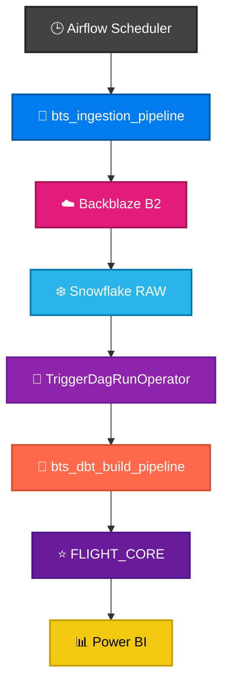
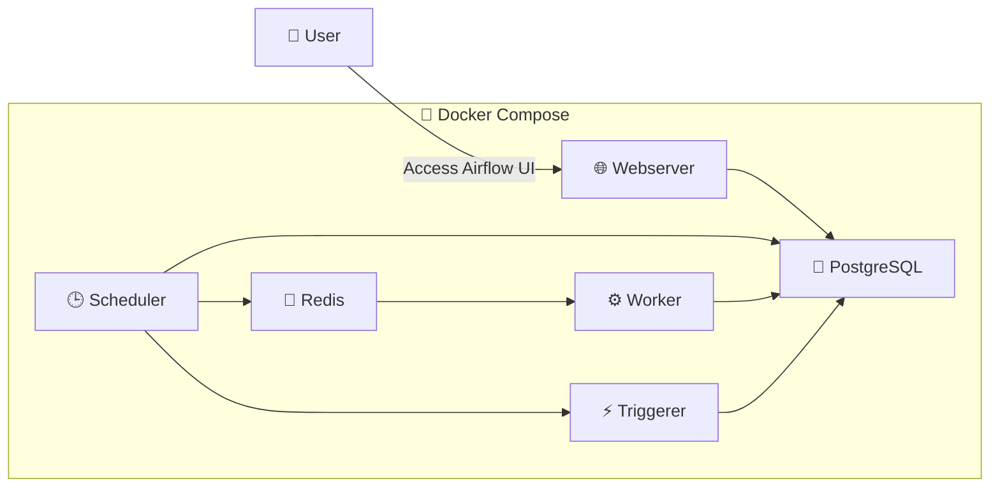

<h1 align="center">🌬️ BTS Airflow Orchestration</h1>

<p align="center">

Containerized Apache Airflow deployment responsible for scheduling, orchestrating, and monitoring the BTS Airline Analytics platform. The orchestration layer automates monthly data ingestion, coordinates downstream warehouse transformations, and provides operational visibility through centralized task execution, dependency management, and automated notifications.

</p>

---

## 📌 Project Overview

| Property | Value |
|----------|-------|
| 🎯 **Purpose** | Orchestrate the end-to-end BTS data platform through automated scheduling, workflow coordination, and recovery |
| 🌬️ **Orchestrator** | Apache Airflow 3.3 |
| 🐳 **Deployment** | Docker Compose with CeleryExecutor |
| 📅 **Schedule** | Monthly (`0 12 1 * *`) |
| 📥 **Ingestion Strategy** | High-water-mark detection |
| ❄️ **Target Warehouse** | Snowflake |
| 🔄 **Transformation** | dbt Core (`TriggerDagRunOperator`) |
| 📧 **Monitoring** | Automated HTML email notifications |

# 📝 Workflow Overview

The Airflow orchestration layer coordinates the complete execution lifecycle of the BTS data platform. It schedules monthly ingestion, discovers newly available datasets, loads RAW data into Snowflake, triggers downstream dbt transformations, and monitors every workflow through automated notifications.



---

## 🚀 Execution Flow


### Pipeline Stages

- ⏱️ The Airflow Scheduler initiates the monthly ingestion workflow according to the configured schedule.
- 🔍 The ingestion DAG identifies any missing BTS reporting months using a high-water-mark strategy.
- ☁️ Required datasets are downloaded, validated, and uploaded to Backblaze B2.
- ❄️ Newly available files are loaded into Snowflake RAW tables.
- 🔄 After a successful load, Airflow triggers the independent dbt transformation DAG.
- ⭐ dbt builds and refreshes the analytics warehouse inside the `FLIGHT_CORE` schema.
- 📊 The refreshed warehouse becomes immediately available for downstream analytical tools such as Power BI.


# 📁 Project Structure

```text
📦 airflow-docker
│
├── 📂 dags
│   ├── bts_ingestion_pipeline.py
│   └── bts_dbt_build_pipeline.py
│
├── 📂 assets
│   ├── pipeline_architecture.svg
│   ├── workflow_diagram.svg
│   ├── airflow_ingestion_success.png
│   └── airflow_dags_list.png
│
├── ⚙️ docker-compose.yaml
└── 📄 README.md
```


# 📂 Directory Overview

| Directory | Description |
|-----------|-------------|
| `dags/` | Contains all Airflow workflows responsible for ingestion orchestration and dbt execution. |
| `assets/` | Stores architecture diagrams, workflow illustrations, and execution screenshots used throughout the documentation. |


# 🌬️ Airflow DAGs

| DAG | Trigger | Responsibility |
|------|---------|----------------|
| 📥**bts_ingestion_pipeline** | Monthly Scheduler | Coordinates the complete ingestion workflow, from detecting missing datasets through loading Snowflake RAW tables. |
| 🔄**bts_dbt_build_pipeline** | TriggerDagRunOperator | Executes the downstream dbt build process after successful ingestion. |


## 📥 Ingestion Pipeline
 
| Task | Responsibility |
|------|----------------|
| 🔍 `get_missing_months` | Detect missing partitions |
| 🌐 `download_upload_to_b2` | Download ZIPs and upload to B2 |
| ❄️ `load_to_snowflake` | Load RAW tables |
| 🚀 `trigger_dbt_build` | Trigger dbt DAG |
| 📧 `send_status_email` | Email the overall run outcome |
 
 
 
## 🔄 dbt Build Pipeline
 
| Task | Responsibility |
|------|----------------|
| ⚙️ `dbt_build` | Execute `dbt build` via BashOperator |
| 📧 `send_dbt_result_email` | Email the dbt build outcome and output |


# 🐳 Docker Architecture


### Container Responsibilities

| Service | Responsibility |
|----------|----------------|
| 🌐 Webserver | Hosts the Airflow user interface and REST API. |
| 🕒 Scheduler | Evaluates schedules and creates DAG runs. |
| ⚙️ Worker | Executes tasks distributed by the CeleryExecutor. |
| ⚡ Triggerer | Handles deferred and asynchronous task execution. |
| 🔴 Redis | Message broker between the Scheduler and Workers. |
| 🐘 PostgreSQL | Stores Airflow metadata, DAG states, logs, and execution history. |


# 🧩 Design Decisions

## 🌌 Two Independent DAGs

The orchestration layer intentionally separates ingestion and transformation into two independent DAGs rather than combining every task into a single workflow.

This design provides several operational advantages:

- Better fault isolation
- Independent retries
- Easier monitoring
- Simpler debugging
- Manual re-execution of either workflow
- Clear separation of responsibilities


## 🔁 TriggerDagRunOperator

The ingestion workflow triggers the transformation workflow through `TriggerDagRunOperator`, keeping both pipelines loosely coupled.

This approach allows:

- dbt to execute only after successful ingestion.
- Independent execution of the transformation workflow.
- Faster recovery from failures.
- Clear ownership for each DAG.

## 🕐 High-Water-Mark Strategy

Rather than relying on Airflow Catchup to replay missed schedules, the ingestion workflow dynamically determines which reporting months are missing at runtime.

Every missing partition is processed during a single DAG run, enabling historical recovery without generating multiple backfilled DAG executions.

Benefits include:

- Faster recovery
- Reduced scheduler overhead
- Simpler operational management
- Idempotent pipeline execution


## 📸 Successful Execution


> ✅ Scheduled execution (`2026-07-18`) completed successfully with every task reaching the **Success** state.

---

## 📥 Ingestion DAG Graph


> **bts_ingestion_pipeline** orchestrates the monthly ingestion workflow by detecting missing reporting months, downloading source data, loading Snowflake RAW tables, and triggering the downstream transformation pipeline.

---

## 🔄 dbt Build DAG Graph


> **bts_dbt_build_pipeline** executes the complete `dbt build` workflow after successful ingestion, ensuring that the analytics warehouse remains synchronized with the latest RAW data.

# 🏷️ Airflow DAG Summary

| DAG | Schedule | Purpose |
|------|----------|---------|
|📥**bts_ingestion_pipeline** | Monthly (`0 12 1 * *`) | Detect missing datasets, ingest new data into Snowflake, and trigger downstream transformations. |
| 🔄**bts_dbt_build_pipeline** | Triggered | Build, test, and publish the analytics warehouse using dbt Core. |

# 🛠️ Technology Stack

| Category | Technology |
|----------|------------|
| 🌬️ Orchestration | Apache Airflow 3.3 |
| 🐳 Containers | Docker Compose |
| 🐍 Language | Python 3.12 |
| ❄️ Warehouse | Snowflake |
| 🔄 ELT | dbt Core |
| 🪣 Storage | Backblaze B2 |
| 🐘 Metadata | PostgreSQL |
| 📬 Queue | Redis + Celery |
| 📊 Data Processing | pandas |
| ☁️ SDK | boto3 |
| 🌐 HTTP | requests |
| 🔄 Retry | Tenacity |